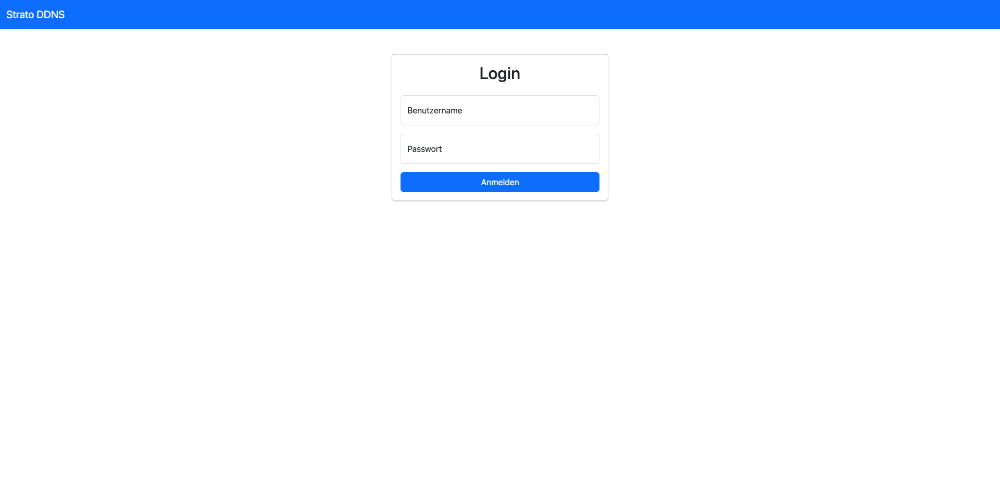
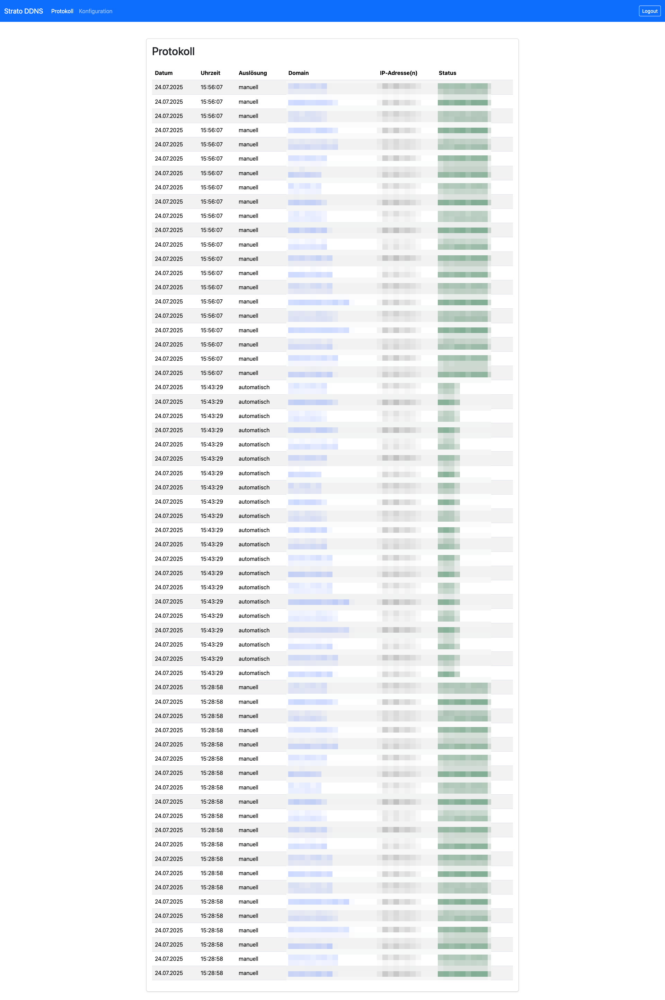
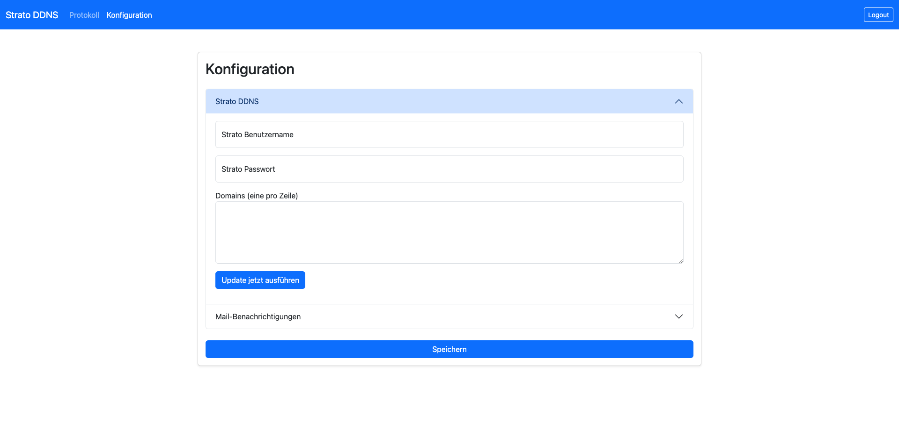
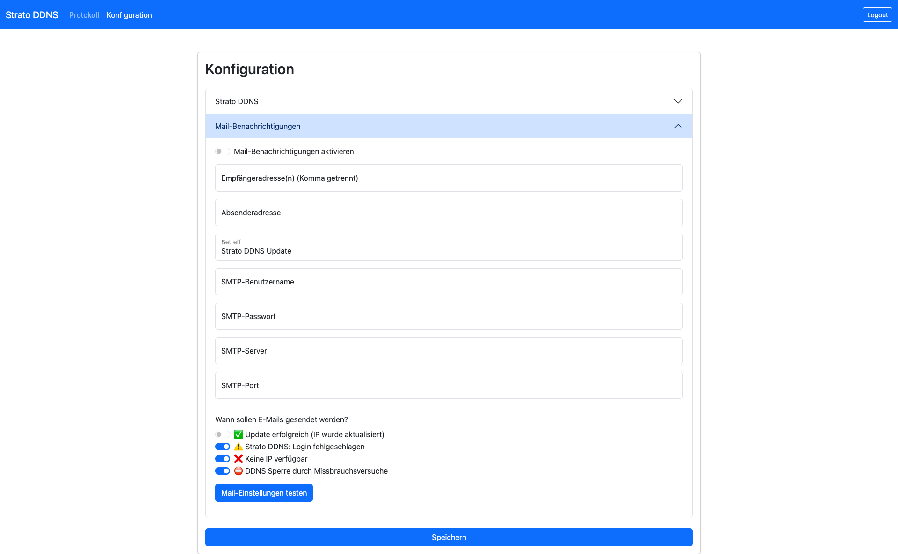
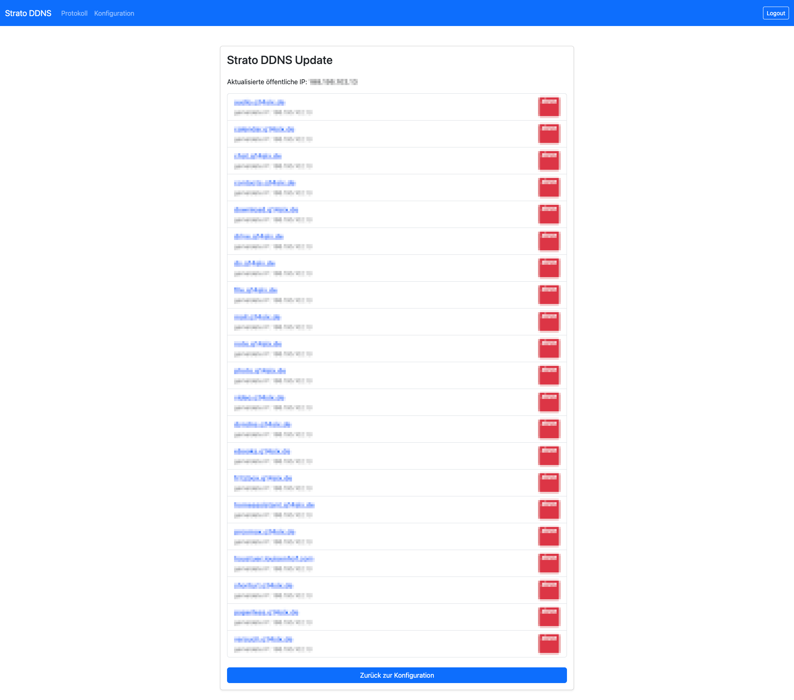

# 📡 Strato DDNS – Automatischer Strato-DynDNS-Updater mit Web-Frontend

[](https://github.com/Q14siX/strato-ddns/releases)
[](LICENSE)


**Self-hosted Updater-Dienst für Strato-Domains mit Weboberfläche, Logging und einfacher Integration z.B. in die Fritz!Box als DynDNS-Client.**

---

## 📚 Inhaltsverzeichnis

- [📡 Überblick](#-überblick)
- [✨ Funktionen](#-funktionen)
- [🧩 Systemarchitektur & Komponenten](#-systemarchitektur--komponenten)
- [⚡️ Installation](#-installation)
- [🚀 Erste Schritte](#-erste-schritte)
- [🔗 Integration mit der Fritz!Box](#-integration-mit-der-fritzbox)
- [⚙️ Konfiguration & Bedienung](#-konfiguration--bedienung)
- [📊 Log- und Monitoring-Funktionen](#-log--monitoring-funktionen)
- [🔒 Sicherheitshinweise](#-sicherheitshinweise)
- [🧹 Deinstallation & Wartung](#-deinstallation--wartung)
- [📂 Verzeichnisstruktur](#-verzeichnisstruktur)
- [❓ FAQ](#-faq)
- [💬 Support & Weiterentwicklung](#-support--weiterentwicklung)
- [📄 Lizenz](#-lizenz)

---

## 📡 Überblick

**Strato DDNS** ist ein selbstgehosteter Updater-Dienst für Strato-Domains:  
Er empfängt DynDNS-Update-Anfragen (z. B. von der Fritz!Box) und aktualisiert daraufhin automatisiert die hinterlegte öffentliche IP-Adresse deiner Domains bei Strato – per Web-Frontend konfigurierbar, mit ausführlicher Protokollierung und einfachen Verwaltungsfunktionen.

Das Projekt richtet sich an Nutzer, die ihre Strato-Domains dynamisch halten möchten und dabei maximale Kontrolle, Transparenz und eigene Infrastruktur bevorzugen.

**Wichtig:**  
Dies ist kein eigener DNS-Server! Das System stößt gezielt das Update deiner IP-Adresse bei Strato an.

---

## ✨ Funktionen

- **Automatische IP-Updates bei Strato:**  
  DynDNS-kompatibler Endpunkt nimmt Anfragen (z.B. Fritz!Box) entgegen und überträgt die aktuelle IP direkt an Strato.
- **Web-Frontend:**  
  - Sicherer Login-Bereich  
  - Konfigurationsseite für Domains, Zugangsdaten, Mailbenachrichtigungen und mehr  
  - Protokoll/Logbuch aller durchgeführten Updates
- **Mail-Benachrichtigung (optional):**  
  Auf Wunsch Benachrichtigung bei erfolgreichen oder fehlgeschlagenen Updates.
- **Systemdienst:**  
  Läuft als systemd-Service, startet automatisch beim Boot.
- **Responsives Design:**  
  Bootstrap-basiertes Webinterface, nutzbar am PC, Tablet und Smartphone.
- **Shell-Skripte für Setup und Verwaltung**
- **IPv4/IPv6-Support**
- **Einfache Installation und Deinstallation**

---

## 🧩 Systemarchitektur & Komponenten

- **Shell-Skripte:** Installation, Einrichtung, Wartung und Entfernen.
- **Python-Flask-Web-App:** Stellt API-Endpunkte und Web-Frontend bereit.
- **Templates:** Flexibel anpassbares Design des Frontends.
- **Systemd-Service:** Für dauerhaften Betrieb.
- **Konfigurations- und Logdateien:** Einstellungen im JSON-Format, Protokoll im XML-Format.
- **Frontend-Screenshots:** Für Hilfe und Dokumentation.

---

## ⚡️ Installation

Installiere den Dienst mit folgendem Befehl:

```sh
bash <(wget -qO- https://github.com/Q14siX/strato-ddns/releases/latest/download/strato-ddns-start.sh)
```

- Das Skript installiert alle Abhängigkeiten, legt das Projektverzeichnis an und fragt dich nach Zugangsdaten für das Web-Frontend.
- Nach Abschluss erreichst du das Frontend unter:  
  `http://<DEINE_SERVER_IP>:5000`

---

## 🚀 Erste Schritte

1. **Login-Daten vergeben:**  
   Während der Installation wirst du nach Benutzername und Passwort für das Webinterface gefragt.
2. **Browser öffnen:**  
   Web-Interface aufrufen:  
   ```
   http://<DEINE_SERVER_IP>:5000
   ```
3. **Konfiguration:**  
   Trage Strato-Login, zu pflegende Domains und gewünschte Einstellungen ein.

---

## 🔗 Integration mit der Fritz!Box

Trage in deiner Fritz!Box als DynDNS-Anbieter folgende Update-URL ein:

```
http://<DEINE_SERVER_IP>:5000/auto?username=<username>&password=<pass>&myip=<ipaddr>,<ip6addr>
```
oder (nur IPv4/IPv6):

```
http://<DEINE_SERVER_IP>:5000/auto?username=<username>&password=<pass>&myip=<ipaddr>
http://<DEINE_SERVER_IP>:5000/auto?username=<username>&password=<pass>&myip=<ip6addr>
```

**Ablauf:**  
- Die Fritz!Box sendet regelmäßig die aktuelle öffentliche IP an diesen Endpunkt.
- Der Dienst aktualisiert daraufhin die hinterlegte(n) Domain(s) bei Strato automatisch.

---

## ⚙️ Konfiguration & Bedienung

**Web-Frontend-Funktionen:**
- Sicherer Login (nur autorisierte Nutzer können Einstellungen und Logs einsehen)
- Konfigurationsmaske für:
  - Strato-Zugangsdaten (Benutzername, Passwort)
  - Domain-Liste
  - Mail-Benachrichtigungen (optional)
  - Testmails senden
- Alle Änderungen werden direkt übernommen und protokolliert
- **Logbuch:**  
  Alle Update-Vorgänge, Fehler und Statusmeldungen mit Zeitstempel, Domain, IP und Trigger, farblich aufbereitet, sortierbar und durchsuchbar

**Shellskripte für:**
- Zugangsdaten ändern
- Sperre des Frontends zurücksetzen (z.B. nach zu vielen Fehlversuchen)
- Deinstallation und Wartung

---

## 📊 Log- und Monitoring-Funktionen

- Lückenlose Protokollierung aller DynDNS-Updates und Fehler in einer XML-Datei
- Übersichtliches Logbuch im Web-Frontend
- Farbige Statusanzeigen (Erfolg, Fehler, Warnungen)
- E-Mail-Benachrichtigung bei konfigurierten Ereignissen möglich

---

## 🔒 Sicherheitshinweise

- Zugang zum Web-Frontend durch eigenen Login geschützt
- Zugangsdaten werden lokal gespeichert (empfohlen: Server nicht öffentlich erreichbar machen und/oder Zugriff durch Firewall/VPN begrenzen)
- Automatische Sperre nach mehreren Fehlversuchen, Entsperrung per Skript möglich
- Keine Weitergabe deiner Daten an Dritte (ausgenommen Strato-API)

---

## 🧹 Deinstallation & Wartung

**Komplett deinstallieren:**
```sh
bash <(wget -qO- https://github.com/Q14siX/strato-ddns/releases/latest/download/strato-ddns-start.sh)
```

---

## 📂 Verzeichnisstruktur

```
strato-ddns/
├── scripts/                 # Setup- und Verwaltungs-Skripte
├── templates/               # Web-Templates für die Seiten des Logins, Protokolls, Konfiguration und Update
├── images/frontend/         # Screenshots für README & Dokumentation
├── LICENSE                  # MIT Lizenz
└── README.md                # Diese Datei
```

---

## ❓ FAQ

**Ist das ein eigener DNS-Server?**  
Nein. Der Dienst nimmt DynDNS-Update-Requests (z. B. von der Fritz!Box) entgegen und stößt das Update deiner öffentlichen IP bei Strato an.

**Welche Systeme werden unterstützt?**  
Alle gängigen Linux-Distributionen mit Python3 und systemd (getestet mit Ubuntu, Debian, Raspberry Pi OS).

**Was passiert mit meinen Zugangsdaten?**  
Sie werden ausschließlich lokal gespeichert und nur für das Update bei Strato verwendet.

**Kann ich weitere Domains hinzufügen?**  
Ja, beliebig viele Strato-Domains sind über das Webinterface einstellbar.

**Wie ändere ich das Design des Frontends?**  
Passe die Dateien im Verzeichnis `templates/default/` nach deinen Wünschen an.

---

## 💬 Support & Weiterentwicklung

- [GitHub-Projektseite](https://github.com/Q14siX/strato-ddns)
- Feature Requests, Bugreports und Pull-Requests willkommen!

---

## 📄 Lizenz

Dieses Projekt steht unter der [MIT-Lizenz](LICENSE).  
Frei zur Nutzung, Änderung und Weiterverbreitung unter Nennung der ursprünglichen Autoren.

---

**Hinweis:**  
*Dieses Projekt steht in keiner Verbindung zur Strato AG, AVM oder anderen Dritten. Die Nutzung erfolgt auf eigenes Risiko.*

---

## Screenshots

| Login-Seite                    | Protokoll-Seite                |
| ------------------------------ | ------------------------------ |
|  |  |
| Konfigurations-Seite           | Update-Seite                   |
|   |  |

---
